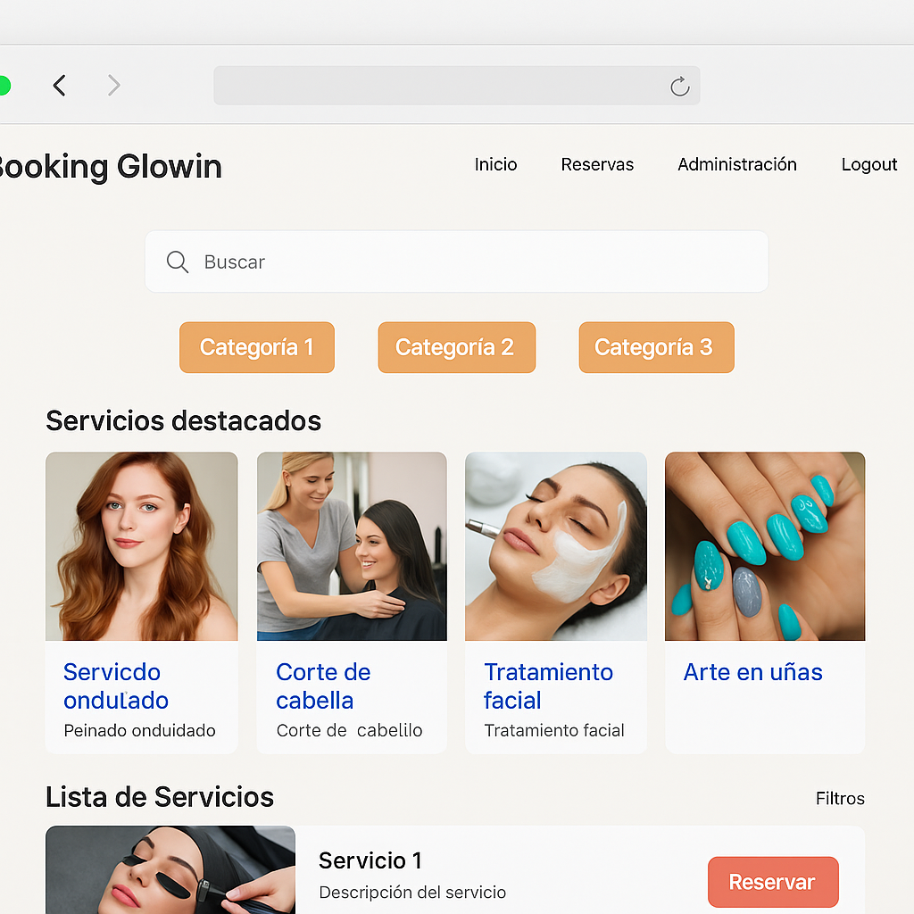

# 💅 Booking Glowin — Sistema de Reservas para Salón de Belleza



**Booking Glowin** es una aplicación web de reservas en línea orientada a la gestión integral de servicios en un salón de belleza. Los usuarios pueden explorar servicios, reservar citas, dejar reseñas, y los administradores pueden gestionar todo desde un panel intuitivo.

---

## 📌 Descripción

Plataforma moderna, responsive y fácil de usar que incluye:

- Visualización detallada de servicios.
- Búsqueda, filtrado y categorización.
- Reservas desde frontend con conexión pendiente al backend.
- Panel administrativo para control interno del salón.

---

## 🚀 Tecnologías Utilizadas

### 🔷 Frontend
- **React**
- **React Router**
- **Material UI**
- **Styled Components**

### 📊 Gestión de Datos
- JSON provisional

### 🔁 Manejo de Peticiones
- Axios o Fetch *(pendiente integración con backend)*

### 🧪 Pruebas
- Jest
- React Testing Library

### 🗃️ Control de Versiones
- Git & GitHub

---

## 🎨 Características Principales

- 🔎 **Buscador de Servicios**
- 🧾 **Sistema de Categorías y Servicios Destacados**
- 🧼 **Lista con Filtros y Paginación**
- 📷 **Detalle de Servicio con Imágenes, Reseñas y Políticas**
- 📆 **Gestión de Reservas por parte del cliente y admin**
- 🛠 **Panel de Administración**
- 📱 **Diseño Responsivo (Desktop, Tablet, Mobile)**

---

## 🔧 Instalación y Configuración

```bash
git clone https://github.com/tu-usuario/booking-glowin.git
cd booking-glowin
npm install
npm run dev
